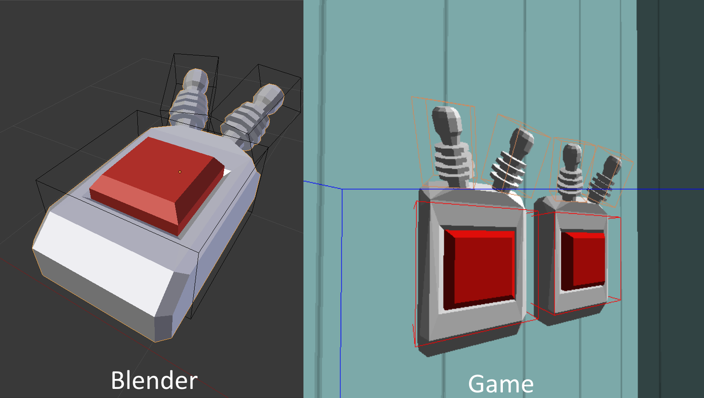
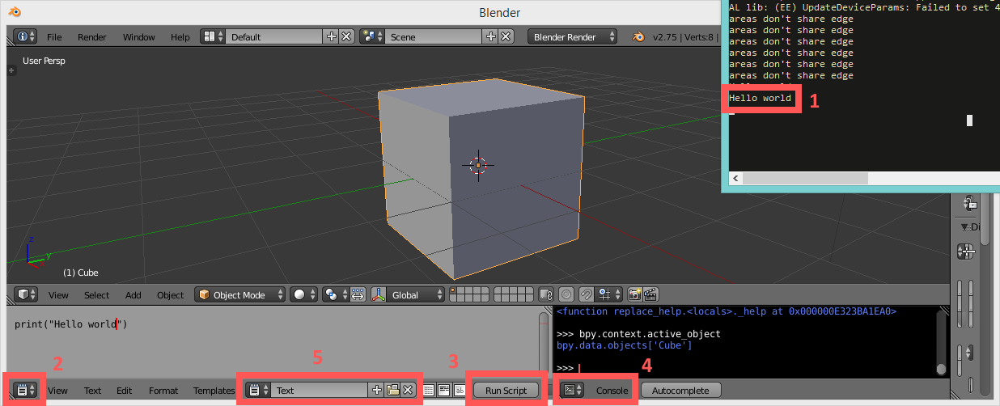

I use blender's built in python scripting capabilities to export models in a custom binary format. This gives me greater control over the model pipeline in my game, in turn allowing me to do some handy things. For example, I can *"draw"* hitboxes in blender and load them directly in my game, without going through external formats or tools.

In this post, I will talk a bit about how to write such an exporter, and which benefits I see in using it over using blender's default exporters. Note that there won't be a complete code sample, as you probably want to write a custom format yourself if you are doing this.



For reference, this was done in blender version *2.75*. Things might be different in other versions!

## Why?

Writing the exporter and corresponding importer definitely was a bit of work, but I still think that it was a worthwhile project. For one, I really enjoyed working on it, and usually that in itself is enough justification for a hobby project. There are however also some tangible benefits over the standard ways of exporting in blender:

For one, I can retrieve exactly the data I am interested in. With other model formats, you have to sift through the information stored in the format to get the values you want in your game. With a custom exporter, you can move this sifting to the exporter as you have full control over the entire pipeline. Additionally, I know for certain that I can parse every valid model file my generator outputs.

As shown in figure 1, I can bundle additional data in my model exports. I am sure you could somehow hoax formats like `.fbx` or `.dae` into doing something like this, but the complexity of these formats have never allowed me to use them efficiently or enjoyably. Being able to place hitboxes directly inside blender gives a nice usability and productivity benefit, as I don't have to fiddle around with some other custom solution.


## The basics of scripting in blender

In case you have never scripted in blender, I will give a brief introduction to this. Feel free to skip ahead if you already know this.

First, you need to set yourself up for python scripting in blender. There are two "tools" to use: The built-in console and the text editor. Figure 2 shows a sample setup.



Legend for figure 2:

1. Output in the system console. `print()` prints to the system console rather than the integrated console. You can toggle this console via `Window > Toggle System Console`

2. You switch to the built-in text editor using this dropdown. You can also write in an external editor, which is a lot nicer. See [here](https://blender.stackexchange.com/a/56709) for instructions on how to run an external file (Not sure if the solution there is *good* though).

3. Press this button to run your script. For me, the button exports all the models in the scene.

4. The interactive console can be found in the same dropdown menu as the text editor. It has autocomplete (`Ctrl + Space`), which coupled with some guesswork gets you a long way in figuring out the fields available on objects.

5. You can have multiple files open in blender's text editor, and this menu switches between them. At first, it will say `+ New`. If you press it once, it creates a new "file". You have to do this before you can start writing code.

Lastly, you should `import bpy` to access blender's python api.


## Getting data from blender

In order to export data to a custom format, you first have to retrieve it from blender. I'll go over some of the main data sources here. For more detailed info, you can refer to [blender's api](https://docs.blender.org/api/current/).

All objects in the scene can be iterated over with `for object in bpy.context.scene.objects`. You probably only want to export meshes, which you can check for with `object.type == 'MESH'`.

When exporting mesh data, you probably want to triangulate the mesh first, so you don't have to do this in-game before rendering. For objects which are meshes, this can be done as follows:

```python
import bmesh

# Create a mesh you can manipulate from the object data
mesh = bmesh.new()
mesh.from_mesh(object.data)

# Split quads etc. into triangles
bmesh.ops.triangulate(mesh, faces=mesh.faces[:])

# Iterate over faces and vertices.
for face in mesh.faces:
    material_index = face.material_index
    normal = face.normal # for flat shading

    for vert in face.verts:
        position = vert.co
        normal = vert.normal # for smooth shading

mesh.free()
```


You probably also want to export materials, which can be retrieved as follows:

```python
for material_slot in object.material_slots:
    material = material_slot.material
    if material is None:
        # You probably want to cancel the export here
    else:
        diffuse = material.diffuse_color
```

For the hitboxes themselves, I don't actually use blenders meshes. The hitboxes are the simple cubes, which I move around in blenders *object* mode. All info I need about the hitboxes can be retrieved through `object.location`, `object.rotation_*` and `object.dimensions`. Blender stores rotation in different variables depending on the rotation mode selected in the editor. By default, it uses `object.rotation_euler`. You can call `.to_quaternion()` on this if you want to export quaternions. Note that these values only are "reliable" if you don't modify the mesh of an object! 


## Writing a binary file in python

The last step is actually exporting the data. I chose a binary format, as it seemed simpler both to write and parse. Note that I won't be covering the parsing of the format here, as that is somewhat language dependent.

In python, you can write binary data to a file using `struct.pack` (remember to `import struct` first). For example, `struct.pack('<H', my_variable)` creates a binary string of an unsigned 16 bit integer in little endian. Further documentation can be found [here](https://docs.python.org/3/library/struct.html).

You can open a file for writing with `open(file_path, 'wb')`. `'wb'` stands for write binary.

A simple example:
```python
filepath = ""
with open(filepath, 'wb') as file:
    my_vector = ...
    file.write("<fff", my_vector.x, my_vector.y, my_vector.z)
```

In my exporter, I write a long sequence of vectors to represent a mesh. When importing, I then need to know how long this sequence is so I can read it back from the file. Because of this, I write out the number of elements in a sequence before I write the sequence itself. The same goes for writing strings.

Regarding strings, you also have to encode them into a binary string before writing them. This goes as follows:

```python
text = object.name
encoded_text = text.encode('utf-8')

file.write(struct.pack("<H", len(encoded_text)))
file.write(encoded_text)
```

When parsing, you first read the length and then load the next n bytes as a utf-8 encoded string.

## Conclusion

Writing this exporter has allowed me to better integrate blender in my game making process. Furthermore, it brings me a certain joy having finally found what I think is a relatively clean solution to the problem of model importing and exporting. The files created by my exporter are about the same size as standard obj files, but I could probably make them a lot smaller if I were to put in the effort.
