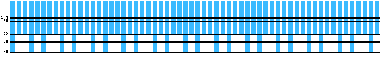
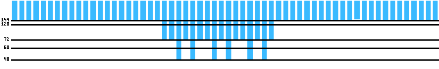

I have one 144Hz monitor and one 60Hz monitor. While doing some d3d11 development I noticed two things that seemed odd:

1. When I put my window on the 60Hz monitor, vsync alternately blocks to 13.9ms or 20.8ms intervals, instead of the expected 16.7ms.

2. My window on the 144Hz monitor gets downgraded to 60FPS if a window on the 60Hz monitor is redrawing.

[^1]: <https://www.youtube.com/watch?v=JFiWtRyOApI>
[^2]: <https://linustechtips.com/topic/1038214-144hz-60hz-dual-monitor-bugfeature/>

This last effect has also been noticed by others [^1] [^2].
Apparently, it might be fixed in newer versions of windows 10.
I'm running windows 8.1 with a Nvidia GTX 750 Ti (driver version 461.72) and have unfortunately _not been able to run tests on another machine yet_.

### Visualizing what is going on

I wrote [a small example program](example.c) to show what is going on.
If you are using MSVC, you should be able to compile it with `cl example.c`.
The graphs below are screenshots from this program (with the numbers on the left hand side added afterwards).
They each show the duration of the last 60 displayed frames, with bar height being proportional to frame duration [^3]. The black bars mark 1/144th of a second, 1/120th of a second, etc.

[^3]: Frame-time variability is low enough on my machine to make the ends of the blue bars always lie beneath the black lines. Unfortunately, this makes the graphs look fake. If I run the program with a larger window size this does not happen.

This graph shows the first issue I observe: The window is running on the 60Hz monitor.
The taller bars are 20.8ms frames, the shorter bars are 13.8ms frames.
The pattern repeats every 5 frames, corresponding to about 83ms.
In this time, the 144Hz monitor should refresh 12 times:
$$\frac{12}{144} = \frac{2}{48} + \frac{3}{72} = \frac{5}{60}$$
As far as I can tell, what is going on is that windows is blocking until it reaches the next multiple of 1/144 seconds after the 60Hz monitors vblank.

This next graph shows the window running on the 144Hz monitor.
The "disturbance" in the middle of the graph is caused by me scrolling text in a browser window on the 60Hz monitor.
This demonstrates the second issue I observed: _If one window tries to run at 60FPS, windows downgrades everybody else to 60FPS_.
As far as I can tell, any redrawing on the 60Hz monitor downgrades my window, regardless of whether vsync is used by the window on the 60Hz monitor. Just moving around the mouse on the 60Hz monitor does however not downgrade me.

When running the 144Hz monitor at 120Hz, things change slightly:
My window still gets downgraded to 60FPS if I do anything on the second monitor, but at least now there no longer are two alternating frame durations when running at 60FPS.

### Caveats

In __windowed__ mode, results are the same with `DXGI_SWAP_EFFECT_FLIP_SEQUENTIAL` and `DXGI_SWAP_EFFECT_DISCARD`, and regardless of whether or not __vsync__ is enabled.
In the example program, you can change lines 338, 531 and 538 to test this yourself.

When running in classic fullscreen neither of the two effects occur:
On the 60Hz monitor vsync synchronizes to 16.7ms multiples and on the 144Hz monitor vsync synchronizes to 6.9ms increments.
In the example program, you can change line 334 to `TRUE` to start in fullscreen mode.

When running in __borderless fullscreen__ on the 144Hz monitor _and_ using `DXGI_SWAP_EFFECT_FLIP_SEQUENTIAL`, the window no longer gets downgraded to "fake" 60FPS, regardless of what is going on on the 60Hz monitor.
However, placing the window on the 60Hz monitor still results in "fake" 60FPS.
In the example program, you can enter borderless fullscreen mode with `F11`.

### Conclusion

There are two questions I have not yet figured out an answer to:

- Do the alternating frame times in "fake" 60FPS inherently cause visual jitter? As far as I can tell, the frames are still getting presented at 16.7ms intervals.

- Does disabling vsync allow us redraw at 144FPS when we otherwise would be getting downgraded to "fake" 60FPS? As far as I can tell, no.

With regards to the first issue from the start of this post:
Simply measuring the last frames duration to determine by how much to advance animation time will lead to poor results.
Ideally you would either average the last 5 frame times, or recognize the pattern of alternating between 13.8ms and 20.8ms and conclude that you should be animating at 60FPS.

With regards to the second issue, I don't think there is a good solution.
However, I guess it's mostly fine to ignore the issue: Animations will occasionally jitter, but that's par for the course when running a non-real-time OS.
